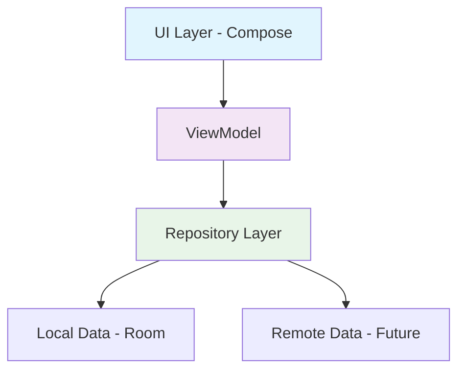

# 📱 PageBook Android

**Нативная Android-реализация** универсального органайзера с акцентом на плавность работы и Material Design! 🚀

[](https://kotlinlang.org)
[](https://developer.android.com/jetpack/compose)
[](LICENSE)
[](CHANGELOG.md)

## 🌟 О проекте

PageBook — это нативное Android-приложение для работы со справочными материалами, заметками, задачами и календарём. Часть кроссплатформенного проекта PageBook, разрабатываемого нативно для обеих платформ.

> 📖 **iOS версия**: [PageBook iOS](https://github.com/MaxGog/PageBook-ios)

## 📖 Документация

- **[Архитектура](docs/ARCHITECTURE.md)** — подробное описание слоёв, потока данных и технических решений.
- **[Участие в разработке](docs/CONTRIBUTING.md)** — как настроить окружение, стиль кода и процесс Pull Request.
- **[История изменений](docs/CHANGELOG.md)** — что нового в каждой версии.

## ✨ Основные возможности

### 📝 Умные заметки
- Создание и редактирование заметок
- Быстрый поиск и фильтрация

### ✅ Менеджер задач
- To-do листы с приоритетами
- Напоминания и дедлайны
- Прогресс выполнения

### 🗓️ Календарь и планирование
- Ежедневное и недельное планирование
- Интеграция задач и событий
- Гибкие настройки отображения

## 🛠 Технологический стек

- **💚 100% Kotlin** — современный и выразительный код
- **🎨 Jetpack Compose** — декларативный UI
- **💾 Room Database** — надёжное локальное хранение
- **🔄 Coroutines & Flow** — реактивное программирование
- **🧩 Hilt** — модули `NotesModule`, `TodoModule`, `EventModule`
- **📐 Material Design 3**

## 🏗 Архитектура


```mermaid
graph TD
    A[UI Layer - Compose] --> B[ViewModel]
    B --> C[Repository Layer]
    C --> D[Local Data - Room]
    C --> E[Remote Data - Future]

    style A fill:#e1f5fe
    style B fill:#f3e5f5
    style C fill:#e8f5e8
```

### MVVM + Repository
- **UI Layer**: Jetpack Compose + ViewModel
- **Data Layer**: Repository pattern + Room
- **Domain Layer**: _Планируется_ (Use Cases пока отсутствуют)

Подробнее см. в [ARCHITECTURE.md](docs/ARCHITECTURE.md).

## 🚀 Быстрый старт

### Предварительные требования
- Android Studio Hedgehog или новее
- Android SDK 34 (Android 14)
- Kotlin 1.9.0+

### Установка и запуск

1. **Клонируйте репозиторий**
   ```bash
   git clone https://github.com/MaxGog/PageBook-android.git
   cd PageBook-android
   ```

2. **Откройте в Android Studio**
   - File → Open → Выберите папку проекта
   - Дождитесь завершения сборки зависимостей

3. **Запустите приложение**
   - Подключите Android-устройство или запустите эмулятор
   - Нажмите ▶️ Run или `Ctrl + R`

## 📁 Структура проекта

```
app/src/main/java/ru/maxgog/pagebook/
├── ui/
│   ├── app/            # CombinedApp — навигация и корневой Composable
│   └── theme/          # Тема Material 3
├── models/             # Room-сущности (NoteModel, TodoModel, EventModel)
├── dao/                # DAO-интерфейсы
├── rooms/              # RoomDatabase (Singleton для каждой БД)
├── repositories/       # Репозитории
├── PageBookApplication.kt
└── MainActivity.kt
```

## 🧩 Функциональные возможности

| Возможность | Описание                  | Технологии               |
|-------------|---------------------------|--------------------------|
| **Notes**   | Управление заметками 📝   | Compose, Room, ViewModel |
| **Todos**   | To-do листы и задачи ✅   | Compose, StateFlow, Room |
| **Events**  | Планирование и события 🗓️ | Compose, Date Picker     |

## 🛠 Разработка

### Сборка проекта
```bash
./gradlew assembleDebug
```

### Тестирование
```bash
./gradlew test
```

### Анализ кода
```bash
./gradlew ktlintCheck
```

Полный гайд по настройке окружения и процессу PR — в [CONTRIBUTING.md](docs/CONTRIBUTING.md).

## 🤝 Участие в разработке

Мы рады контрибьюторам! Кратко:

- **🐛 Баги** — создайте [Issue](https://github.com/MaxGog/PageBook-android/issues) с шагами воспроизведения.
- **💡 Идеи** — откройте Issue с меткой `enhancement`.
- **🔧 Pull Requests** — следуйте процессу из [CONTRIBUTING.md](docs/CONTRIBUTING.md).
- **🏷️ Good First Issues** — начните с задач с этой меткой.

## 🎯 Планы развития

- [ ] **Синхронизация с облаком** ☁️
- [ ] **Тёмная тема** 🌙
- [ ] **Виджеты для главного экрана** 🏠
- [ ] **Резервное копирование** 💾
- [ ] **Голосовые заметки** 🎤
- [ ] **Kotlin Multiplatform** для общей бизнес-логики

## 📄 Лицензия

Этот проект распространяется под лицензией MIT. Подробнее см. в файле [LICENSE](LICENSE).

## 👨‍💻 Автор

**MaxGog**
- GitHub: [@MaxGog](https://github.com/MaxGog)

## 💬 Обратная связь

Есть вопросы или предложения? Не стесняйтесь:
- Создать [Issue](https://github.com/MaxGog/PageBook-android/issues)
- Написать в Discussions